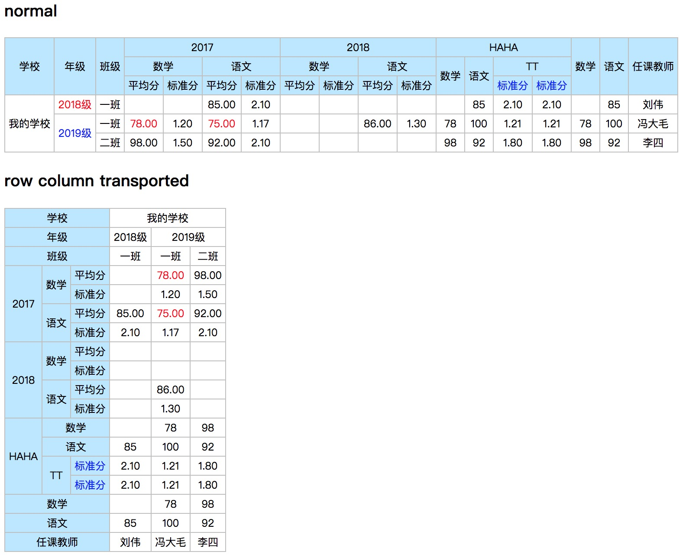

# TABLIX



## 配置

```
{
    // 行组
    rowGroup: {
        field: 'field_name',
        sort: (a,b) => {},
        // 嵌套组可选
        group: {
            
        }
    },
    // 列及列组
    columns: [
        {
            field: 'file_name',
            name: 'show name',
            rowSpan: 3,         // 根据所有头部行数计算
            sort: (a,b) => {},
            style: '',
            className: '',
            render: (value, rowData) => {}
        },
        {
            // 最顶层列组
            group: {
                field: 'field_name',
                sort: (a,b) => {},
                columns: [
                    // 分组列，可嵌套
                    {
                        group: { 
                            field: 'field_name',
                            sort: (a,b) => {},
                            columns: [
                                {
                                    field: 'field_name',
                                    name: 'show name',
                                    sort: (a,b) => {},
                                    style: '',
                                    className: '',
                                    aggregate: Tablix.AGGREGATE_TYPE.AVG,
                                    render: (value, rowData) => {}
                                }
                            ]
                        }
                    },
                    // 普通列
                    {
                        name: 'show name',
                        columns: [
                            {
                                field: 'field_name',
                                name: '',
                            },
                            {
                                field: 'field_name',
                                name: '',
                            }
                        ]
                    }
                ]
            }
        },
        {
            name: 'show text',
            rowSpan: 2, 
            columns: [              // 解决多行合并错位，多增加一层columns，可根据情况调整
                {
                    rowSpan: 0,     // 表示本行不显示，用于解决多行合并错位
                    columns: [
                        {
                            field: 'field_name',
                            name: '',
                        },
                        {
                            field: 'field_name',
                            name: '',
                        }
                    ]
                }
            ]
        }
    ],
    // 二维表格数据
    data: [
        {
            field_name1: value，
            field_name2: value，
            field_name3: value，
            field_name4: value，
        }
    ],
    style: {},              // table style
    className: '',          // table class
}

```

## 聚合函数

**聚合函数只能用于明细列，并设置了field的列**

### 支持的聚合函数

> Tablix.AGGREGATE_TYPE

- AVG 平均值
- SUM 求和
- COUNT 计数
- MAX 最大值
- MIN 最小值
- FIRST 第一个值，默认聚合函数
- LAST 最后一个值

## 用法

```
import React from 'react';
import ReactDOM from 'react-dom';

import Tablix from './Tablix';

let opt = {
    rowGroup: {},
    columns: {},
    data: [

    ],
    style: {},
    className: '',
};

ReactDOM.render(<Tablix {...opt} />, document.getElementById('root));


```

